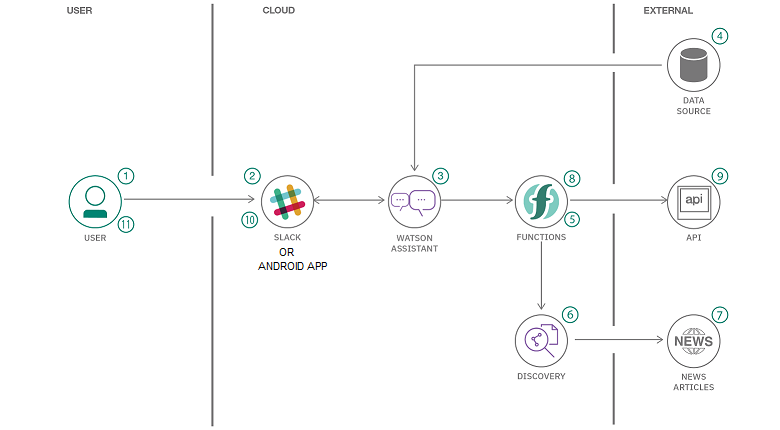

# Fight Corona Android App (Chatbot)
In times of crisis, communications systems are often overwhelmed with people trying to find basic information about testing, symptoms, community response, and other resources.When communication lines get clogged, people who need real help can't get through.
Chatbots help respond to tens, even hundreds of thousands of messages a day without any hassle.

Replace the API key and URL for the Watson, Text to Speech and Speech to Text services in the config.xml available in    
**app > src > main > res > values > config.xml** to make the app work.
Connect Discovery also in the IBM Cloud to get real time number of cases around the world.

Alternatively, your app can be deployed on Slack as well. The slackbot link - https://app.slack.com/client/T0146M525CK/D0146F36UCS

